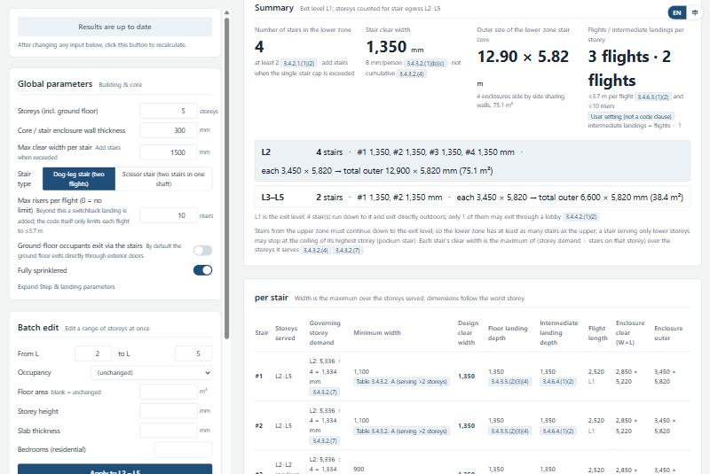
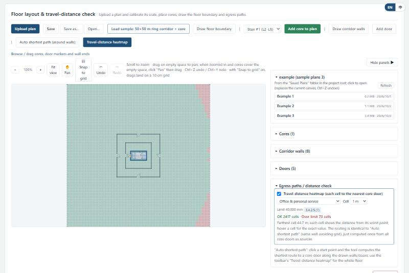
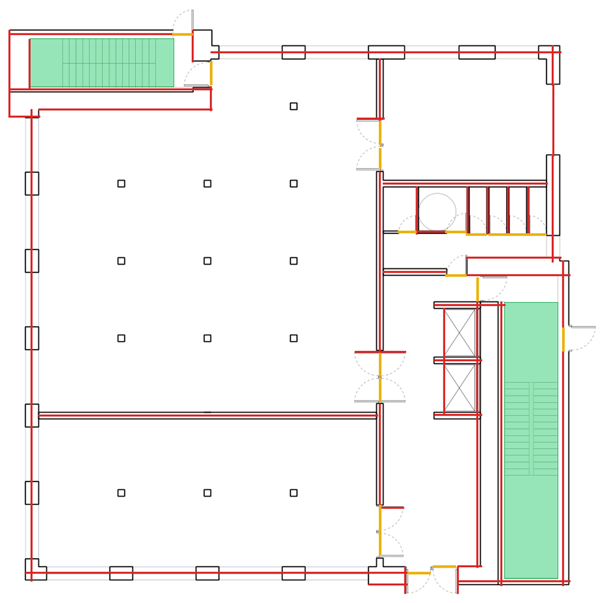

# Stair Core Tool

**▶ Live demo (GitHub Pages): https://jiangpresident.github.io/stair-core-tool/**
Calculator: https://jiangpresident.github.io/stair-core-tool/ · Floor plan tool: https://jiangpresident.github.io/stair-core-tool/plan.html

Vancouver exit-stair calculator and floor-plan egress checker (VBBL 2025 → BCBC 2024 → NBC 2020). UI is English by default; switch to 中文 with the toggle at the top-right.

## 1. Purpose

This tool sizes, counts and lays out the exit stairs in a building's core, following the Vancouver Building By-law, the BC Building Code and the National Building Code of Canada. From each storey's floor area and occupancy it derives the occupant load, and from that the number and clear width of the exit stairs; storey areas, heights and uses can be set individually or edited in batches. The resulting stair-core dimensions feed the second part, the floor plan tool, which checks whether the cores are far enough apart and whether every point on the floor is within the permitted travel distance. The floor plan tool can read a plan from a PDF with several recognition methods, and where recognition falls short the walls and doors can be drawn by hand; a travel-distance heatmap then shows whether every corner of the floor meets the egress requirements.

<details><summary>中文</summary>

这是一个计算建筑核心筒疏散楼梯尺寸、数量与布局的工具，依据温哥华市建筑条例、BC 省建筑规范和加拿大国家建筑规范。用户输入每层的面积和用途，工具算出疏散人数，进而得到疏散楼梯的数量和净宽；每层的面积、层高、功能都可以单独设定，也可以批量修改。算出的核心筒尺寸会传给第二部分——平面图工具：它校核核心筒之间的距离是否合理，以及平面上每个位置是否满足疏散距离要求。平面图工具提供多种识图方法，可以自动读取 PDF 平面图；识别效果不好时也可以在工具里手动画墙画门。画好之后，疏散热力图会显示平面图的每个角落是否都满足疏散规范。

</details>

## 2. How to use it

The tool is a web app with two pages that share data through the browser's local storage:

- **Stair-core calculator** (`/`) — enter storeys, storey heights, floor areas and occupancies; press **Confirm & calculate**. You get the number of exit stairs, clear widths, flights, landings, stair-enclosure sizes, plan / section / 3D drawings, and a per-storey check with clause references.
- **Floor plan tool** (`/plan.html` on the live site, `/plan` locally) — upload a floor plan (PDF or image), **Calibrate scale** by clicking two points of known distance, recognise walls / doors / stairs from the drawing (or draw them), place stair cores from the calculator, then check **exit separation**, **auto shortest egress paths** and the whole-floor **travel-distance heatmap** (green = within limit, red = over). Projects save as `.stairplan.json`.

**Online (GitHub Pages)** — open the links at the top. Everything runs in the browser; nothing is uploaded. On the hosted version the recognition routes available are *vector PDF parsing*, *image edge detection* and *AI recognition* (needs your own Claude / OpenAI API key, stored only in your browser). The *Local Marker* route, the system save dialog and the *example* panel need the local dev server (below).

**Locally (full feature set)** — requires Node.js (with npm) and Python 3.10+:

```bash
git clone https://github.com/jiangpresident/stair-core-tool.git
cd stair-core-tool/_extracted/stair-core
npm install
npm run dev          # http://localhost:5173  (/ calculator, /plan floor plan tool)
```

The dev server also starts the local Floorplan Marker recognition service (`floorplan-marker/`, Python + OpenCV). Create its Python environment once with `floorplan-marker/start_windows.bat` (Windows) or `sh floorplan-marker/start_mac_linux.sh`. On Windows you can instead double-click **`启动平面图工具.bat`** in the repository root, which installs everything on first run and opens the browser.

Example projects to try are in `Saved Plans/` (open them from the **example** panel in the floor plan tool, or with **Open…**); sample drawings are in `Test Plans/`.

Platform notes for the local version: the Local Marker recognition service and the example panel work on Windows, macOS and Linux. The **Save** button opens a native "Save as" dialog (choose any location, then Ctrl+S overwrites the same file) on Windows only; on macOS / Linux it falls back to the browser's own file picker (Chrome / Edge) or to a download into the default downloads folder. The first run needs internet access to download the npm and Python dependencies; after that everything works offline except the optional AI recognition route.

## 3. Source

| Document | Version used | Clauses / tables used |
|---|---|---|
| **Vancouver Building By-law (VBBL) 2025**, Book I, Division B | consolidation incl. the 2026-01-20 revision | takes precedence where it differs: 3.2.10 (single exit stair — Vancouver variant), 3.4.2.3 scissor-stair separation relaxation for small residential buildings, deletion of the former 3.4.1.2.(3) scissor-stair ban |
| **BC Building Code (BCBC) 2024** | Revision 3 (2024-08) | 3.2.10 single-exit residential stair (shown for reference; not adopted by Vancouver) |
| **National Building Code of Canada (NBC) 2020** | 2020 | base text for all clauses below |

Clauses implemented (identical across the three levels unless tagged otherwise in the UI): **3.1.17.1** and **Table 3.1.17.1** (occupant load); **3.4.2.1** (minimum number of exits); **3.4.2.3** (distance between exits, ½ diagonal / 9 m); **3.4.2.5** (travel distance 25 / 30 / 40 / 45 m); **3.4.3.2** and **Tables 3.4.3.2.-A/-B** (exit width per person for stairs and for doorways at 6.1 mm/person, minimum widths incl. 800 mm doorways, non-cumulative storeys, half-width cap); **3.4.6.11.(5)** (each leaf of a multi-leaf exit door ≥ 610 mm; the exit door is sized from the occupants it serves and split into two leaves above a *user-set* single-leaf limit, 1 220 mm by default, since the code sets no maximum); **3.4.3.4** (headroom 2 050 mm); **3.4.4.1 / 3.4.4.4** (fire separation of exits, scissor stairs); **3.4.6.2 – 3.4.6.5, 3.4.6.8, 3.4.6.11, 3.4.6.12** (risers per flight, rise per flight 3.7 m, landings, handrails, treads and risers, doors on landings, door swing / latch side); **3.3.1.9** (public corridor width). Every number shown in the UI carries a clause tag; items marked *user setting* (e.g. max risers per flight) are design conventions, not code requirements.

## 4. Example

**Calculator** — input: 5 storeys, 300 mm core walls, dog-leg stairs, max 1 500 mm per stair, fully sprinklered, default occupancies. Result: 4 stairs in the lower zone (2 above L2), 1 350 mm clear width, 3 flights per storey, lower-zone core 12.90 × 5.82 m, with the governing clause for each value.



**Floor plan tool** — input: the built-in 50 × 50 m sample (ring corridor + one core), occupancy "Office & personal service" (40 m limit). Result: the travel-distance heatmap shows 2 417 cells within the limit and 73 cells over (red corners), farthest cell 44.7 m.



**Recognition** — input: `Test Plans/L1-Vector.pdf` through the local Floorplan Marker route (threshold 230). Result: 44 wall centrelines (red), 19 door openings (yellow), 2 stair enclosures (green), then converted into cores, walls and doors with one click.



## 5. Skill and limits

**Reusable skill file:** [`_extracted/stair-core/CLAUDE.md`](_extracted/stair-core/CLAUDE.md) — the project brief, code-reference conventions and the full development log (what was built in each round, why, and how it was verified); [`_extracted/stair-core/docs/START_PROMPT.md`](_extracted/stair-core/docs/START_PROMPT.md) is the hand-off prompt for continuing the work with an AI assistant.

**What the tool does not do / where a person must check:**

- Schematic-stage estimate only; it does not replace a code review by a registered professional or the Chief Building Official's interpretation.
- Travel distance and exit separation are measured on a rasterised grid (≈ 100–400 mm cells) and on the drawn boundary's envelope — approximations, not the exact routes or floor-area diagonal in the code.
- Recognition from drawings (all four routes) produces *candidates* that must be reviewed; the local route only detects orthogonal walls; AI results depend on the model and cost money.
- Not covered: smoke control (3.2.6), accessibility beyond the door-clearance notes, fire-separation ratings, exterior exits, ramps, and room-to-corridor travel-distance segments.
- Occupancies are simplified to the groups in Table 3.1.17.1; design occupant loads must be posted (3.1.17.1.(2)).

## Appearance

The top-right corner has two toggles: **☀ / ☾** switches between the light theme (unchanged) and an **amber CRT** dark theme modelled on old phosphor terminals (near-black background, monospaced terminal type throughout, square 1 px amber frames with panel titles set into the top edge, inverse-video buttons with a soft glow and faint scanlines), and **EN / 中** switches the interface language. Both are remembered in the browser. Themes are a small registry in `src/theme.js`: add an entry (palette + CSS variables + flags) and the toggle picks it up; for quick experiments, a `stair-core:theme-overrides` JSON in localStorage overrides individual palette colours without touching code.

## Rhino connection (1.1, local version only)

The calculator page has a **Rhino** panel under the 3D model. Its main job is to **check the core boxes you drew in Rhino**: draw each stair core as a box (Brep, extrusion, mesh or closed rectangular curve) on a layer of your choice, and the tool reads its length × width and compares it with the required outer core size of every zone it computed.

1. In Rhino, run `rhino/StairCoreBridge.py` once (Rhino 8: `ScriptEditor`, open the file, run; Rhino 7: `EditPythonScript`). It starts a tiny server on `127.0.0.1:8790` (or the next free port up to 8799) that only accepts requests from this tool.
2. In the calculator, click **Connect Rhino** (shows Rhino version, document and units). The **File** row shows which Rhino file you are connected to: pick one of Rhino's **recent files** or **browse** to make that Rhino window open another `.3dm` (if the current file has unsaved changes, save or discard them in Rhino first). If several Rhino windows run the bridge script, a drop-down lets you choose the window.
3. Pick the layer that holds your core boxes (a layer named like "Core" is picked automatically) and click **Read & check**.
4. Choose how many stairs **each core holds** (one core need not hold all the stairs of a zone). Each box gets one row: ✓ / ✗, its L × W in mm, height, rotation and centre, then per zone "holding k needs W × L (width × run direction): OK (spare …)" or "too small (…)", plus how many shafts the box could hold at most. Rotated boxes are measured by their minimum bounding rectangle; only the chosen layer is read (sub-layers are not included); document units are converted to mm automatically.

**Core doors**: draw each stair door as a small box touching a face of the core box (any thickness) on a door layer and click **Read & check doors**. The tool works out which level each door belongs to (from its underside), which end of the core it is on, and, taking the lowest door as the reference, whether every level's door is at the end where that level's floor landing is (dog-leg stairs alternate ends). Door width is checked against the design leaf width and height against 2 030 mm; missing levels and doors not touching any core are listed.

**Walls**: below the core boxes, pick the layer that holds your walls (lines, polylines or thin solids) and click **Read walls**. Each straight segment becomes a wall; solids are sectioned 500 mm above their base so openings become gaps (pieces use the minimum bounding rectangle for centreline and thickness); arcs are skipped. **Add to floor plan** appends them to the floor plan tool, placed at the top-left of the canvas with Rhino's Y-up flipped to the plan's Y-down; an open plan page refreshes automatically.

**Floors**: below the walls, pick the layer with your floor slabs and click **Read floors**. Only **closed polysurfaces** are accepted; anything else (open polysurface, single surface, mesh) is flagged in red with the reason. For a closed slab the outline of its largest horizontal face is shown with area, vertices, openings and thickness, and **Use as floor boundary** sets it as the plan's floor boundary. Walls and floors imported from Rhino share one coordinate frame (stored in the plan), so they line up with each other.

**Floors / walls by level**: cores and core doors are global; floors and walls are chosen per level. Use the + / − buttons to add or remove levels (up to the storeys in the calculator), pick each level's floor layer and wall layer, and click that level's **Build floor plan**. Each level gets its own plan in the **Rhino floor plan · travel-distance heatmap** panel of the calculator (switch levels with the buttons there), with the heatmap already on and the core door placed from that level's recognised door. Solid walls are sectioned 500 mm above their base, so door openings cut into them become gaps the egress paths can pass through. This plan is kept separately from the floor-plan tool page.

Optionally, the collapsed **Reverse** section sends the computed stair solids (steps, landings, slabs, enclosure walls, doors — the same solids as the 3D view, on separate layers) into Rhino; resending replaces the previous batch under the same layer name.

## Repository layout

| Path | Contents |
|---|---|
| `_extracted/stair-core/` | The web app (React + Vite + three.js). Own `README.md` (scripts, routes) and `CLAUDE.md` (development log). |
| `floorplan-marker/` | Local Python + OpenCV floor-plan recognition service, with its own README. |
| `rhino/` | `StairCoreBridge.py` — run inside Rhino so the calculator can read your core boxes (and optionally receive stair solids); see "Rhino connection". |
| `Saved Plans/` | Example plan projects (`.stairplan.json`). |
| `Test Plans/` | Sample floor-plan PDFs / PNGs. |
| `docs/screenshots/` | Images used in this README. |
| `.github/workflows/pages.yml` | Builds and deploys the static site to GitHub Pages on every push to `main`. |
| `启动平面图工具.bat` | One-click launcher for Windows. |

## Tests

```bash
cd _extracted/stair-core
npm run test:calc && npm run test:pdf && npm run test:raster && npm run test:dimension && npm run test:room
npm run test:ai && npm run test:marker && npm run test:plan-file && npm run test:plan-bridge && npm run test:marker-service
```

## License

[MIT](LICENSE)
